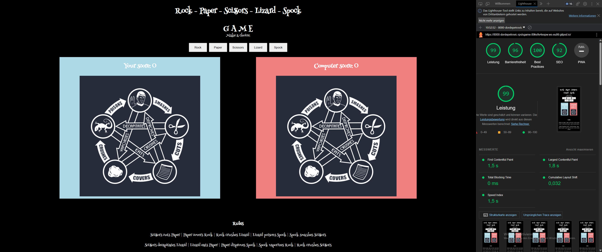
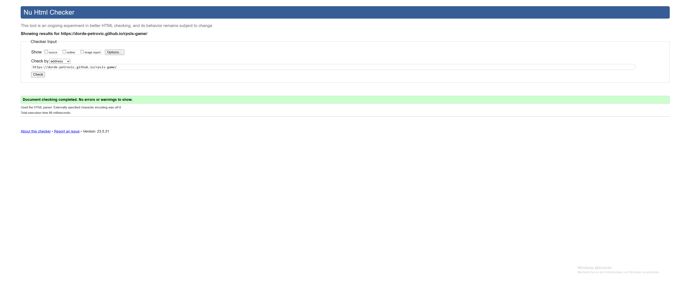
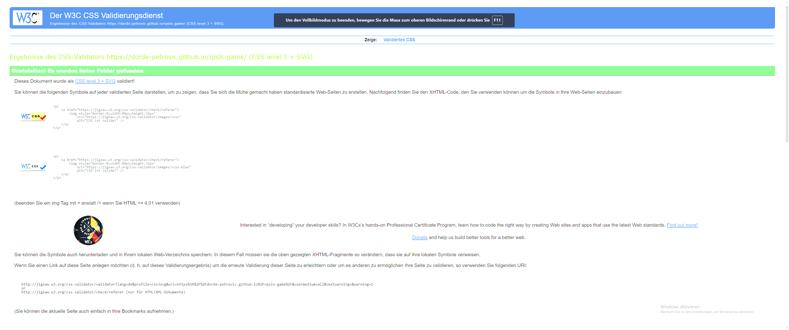
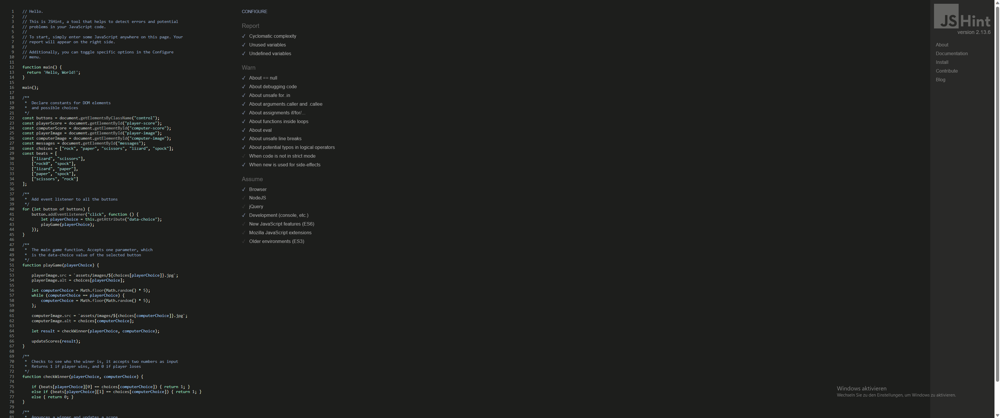

# Rock - Paper - Scissors - Lizard - Spock  GAME

This is a simple game. 

## Demo

A live demo can be found [here](https://dorde-petrovic.github.io/rpsls-game/)

- - -

# Contents
* [Languages Used](#languages-used)
* [User Experience](#user-experience-ux)
* [Design](#design)
  * [Features](#features)
  * [Acessibility](#accessibility)
  * [Color Scheme](#color-scheme)
  * [Typography](#typography)
  * [Icons](#icons)
* [Deployment](#deployment)
  * [Run locally](#run-locally)
  * [Testing](#testing)
* [Credits](#credits)

- - - 

# Languages Used
* JavaScript
* HTML5
* CSS3
- - - 

# User Experience (UX)

## The ideal users for this website is:
* Users who want to amuse themselves

## User stories:
* As a new user, I expect to easily understand the main purpose of the site and navigate without complications.

- - -
# Design

## Features

The website has only one page. I used the base from Portfolio Project Scope Video by Matt Rudge
I made sure that Computer couldn't pick the same object that Player already has picked.

## Accessibility
The website is as accessible as possible:
- Using semantic HTML
- Ensuring that there is a sufficient colour contrast throughtout the site.
- Using descriptive aria-label in the buttons
- Providing information for screen readears where there are icons used and no text.
- Confirming through lighthouse in devtools.

## Color Scheme
I like darker tones.

## Typography
The font Henny Penny is imported from Google Fonts.

## Icons
I didn' use any.

- - -
# Deployment
This site is hosted using GitHub pages, deployed directly from the master branch. The deployed site will update automatically upon new commits to the master branch. In order for the site to deploy correctly on GitHub pages, the landing page must be named index.html.

To deploy this page to GitHub Pages from its [GitHub repository](https://github.com/Dorde-Petrovic/rpsls-game/), the following steps were taken: 
1. Login or Sign Up to GitHub.
2. Open the project repository.
3. From the menu items near the top of the page, select **Settings**.

4. Click on "Pages" in the left hand navigation panel.
5. Under "Source", choose which branch to deploy. This should be Main for newer repositories (older repositories may still use Master).
6. Choose which folder to deploy from, usually "/root".
7. Click "Save", then wait for it to be deployed. 
It can take some time for the page to be fully deployed.
8. Your URL will be displayed above "Source"

## Run locally
**Fork**
1. Login or Sign Up to GitHub.
2. Open the project [repository](https://github.com/Dorde-Petrovic/rpsls-game/).
3. Click the Fork button in the top right corner.

**Clone**
1. Login or Sign Up to GitHub.
2. Open the project [repository](https://github.com/Dorde-Petrovic/rpsls-game/).
3. Click on the code button, select whether you would like to clone with HTTPS, SSH or GitHub CLI and copy the link shown.
4. Open the terminal in the code editor of your choice and change the current working directory to the location you want to use for the cloned directory.
5. Type 'git clone' into the terminal and then paste the link you copied in step 3. Press enter.

---
# Testing 
The different aspects of the site work as intended and have an expected outcome providing an easy and straightforward way for the users to achieve their goals.
Chrome development tools were used during the development of the site to identify and resolve any issues as it progressed.
The performance was tested manual and automated testing.

## Functionality
### Validators
W3C Markup Validator, W3C CSS Validator Services and Jshint  were used to validate this project to ensure that there were no syntax errors.
- Markup Validator

- CSS Validator

- JavaScript Validator

### Lighthouse 
Lighthouse within the Chrome Developer Tools are used to test performance, accessibility, best practices and SEO of the Website.

## Compatibility
The website displays correctly across different browsers and screen sizes.

It was checked on Chrome, Firefox, Safari and Edge.

## Responsiveness
Chrome developer tool have been used to check the responsivness. 

Media queries are used for more responsiveness.

## Solved bugs
I had many syntax errors to fix

# Credits
## Code
The project was inspired by Portfolio Project Scope Video by Matt Rudge and is not a copy. Everything that was added is my original code

## Acknowledgements

* My girlfriend for all the support and help to solve the bugs.

- - - 

Developed By Petrovic Dorde for Code Institute's Portfolio Project 2 - 2023