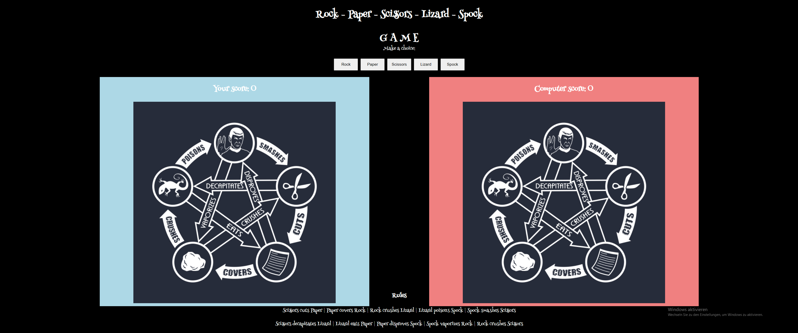

# Rock - Paper - Scissors - Lizard - Spock  GAME

This is a simple game. 

## Demo

A live demo can be found [here](https://dorde-petrovic.github.io/rpsls-game/)

- - -

# Contents
* [Languages Used](#languages-used)
* [User Experience](#user-experience-ux)
* [Design](#design)
  * [Features](#features)
  * [Acessibility](#accessibility)
  * [Color Scheme](#color-scheme)
  * [Typography](#typography)
  * [Icons](#icons)
* [Deployment](#deployment)
  * [Run locally](#run-locally)
  * [Testing](#testing)
* [Credits](#credits)

- - - 

# Languages Used
* JavaScript
* HTML5
* CSS3
- - - 

# User Experience (UX)

## The ideal users for this website is:
* Users who want to amuse themselves

## User stories:
* As a new user, I expect to easily understand the main purpose of the site and navigate without complications.

- - -
# Design

## Features

The website has only one page. I used the base from Portfolio Project Scope Video by Matt Rudge
I made sure that Computer couldn't pick the same object that Player already has picked.

## Accessibility
The website is as accessible as possible:
- Using semantic HTML
- Ensuring that there is a sufficient colour contrast throughtout the site.
- Using descriptive aria-label in the buttons
- Providing information for screen readears where there are icons used and no text.
- Confirming through lighthouse in devtools.

## Color Scheme
I like darker tones.

## Typography
The font Henny Penny is imported from Google Fonts.

## Icons
I didn' use any.

- - -
# Deployment
This site is hosted using GitHub pages, deployed directly from the master branch. The deployed site will update automatically upon new commits to the master branch. In order for the site to deploy correctly on GitHub pages, the landing page must be named index.html.

To deploy this page to GitHub Pages from its [GitHub repository](https://github.com/Dorde-Petrovic/rpsls-game/), the following steps were taken: 
1. Login or Sign Up to GitHub.
2. Open the project repository.
3. From the menu items near the top of the page, select **Settings**.

4. Click on "Pages" in the left hand navigation panel.
5. Under "Source", choose which branch to deploy. This should be Main for newer repositories (older repositories may still use Master).
6. Choose which folder to deploy from, usually "/root".
7. Click "Save", then wait for it to be deployed. 
It can take some time for the page to be fully deployed.
8. Your URL will be displayed above "Source"

## Run locally
**Fork**
1. Login or Sign Up to GitHub.
2. Open the project [repository](https://github.com/Dorde-Petrovic/rpsls-game/).
3. Click the Fork button in the top right corner.

**Clone**
1. Login or Sign Up to GitHub.
2. Open the project [repository](https://github.com/Dorde-Petrovic/rpsls-game/).
3. Click on the code button, select whether you would like to clone with HTTPS, SSH or GitHub CLI and copy the link shown.
4. Open the terminal in the code editor of your choice and change the current working directory to the location you want to use for the cloned directory.
5. Type 'git clone' into the terminal and then paste the link you copied in step 3. Press enter.

---
# Testing 
The different aspects of the site work as intended and have an expected outcome providing an easy and straightforward way for the users to achieve their goals.
Chrome development tools were used during the development of the site to identify and resolve any issues as it progressed.
The performance was tested manual and automated testing.

## Functionality
### Validators
W3C Markup Validator, W3C CSS Validator Services and Jshint  were used to validate this project to ensure that there were no syntax errors.
- Markup Validator

- CSS Validator

- JavaScript Validator

### Lighthouse 
Lighthouse within the Chrome Developer Tools are used to test performance, accessibility, best practices and SEO of the My to do list Website.
- Desktop

- Mobile

### Manual as an user: 
 
Features Identification (FID):  
1. Add a task: input text + button
2. Search tool: input
3. Filter tool values: all, done and pending
4. Check button
5. Remove button
6. Edit button and save button
7. Scroll bar height

|FID| Test Label | Test Action | Expected Outcome | Test Outcome |
|:---|:--- |:--- |:--- |:--- |
|1| Add a task | On input field, attempt to create a new task | Task is created either with enter or click on the plus button| PASS |
|1| Add a empty task | On input field, attempt to create a empty task | Empty task is not created | PASS |
|1+2| Add a task with not empty search input| Attempting to create new task with a few characters in the search input| Task is created, search tool is reset and I can see my new task| PASS |
|1+3| Add a task with filter as "done"| Attempting to create new task with filter on done| Task is created, the filter is reset for all tasks and I can see my new task| PASS |
|1+3| Add a task with filter as "pending"| Attempting to create new task with filter on pending| Task is created, the filter is reset for all tasks and I can see my new task| PASS |
|1+6| Add a task without completing the edition of another task| Attempt to create a task without completing the editing of another task| New task is created and the other task can continue to be edited and saved| PASS |
|1+4+ 5+6| Hover efect and cursor pointer | Placing the mouse cursor on the target button | Changing the color and to cursor pointer | PASS |
|4| Check the task | On check button, attempt to check the task and the display changes to done | Task is checked as done | PASS |
|4| Return a done task to a pending task | On check button, attempt to return a done task to pending task | Task is returned as pending| PASS |
|3+4| Using filter as done, check a done task to return a pending | Set the filter as done and check one done task | Task is returned as pending and the filter displays only the currently checked tasks| PASS |
|3+4| Using filter as pending, check a pending task | Set the filter as pending and check the task | Task is checked as done and the filter displays only the currently pending tasks | PASS |
|5| Remove a pending task | On x button, attempt to remove a pending task | Pending task is removed | PASS |
|5| Remove a done task | On x button, attempt to remove a done task | Done task is removed | PASS |
|6| Edit a pending task | On edit button, attempt to edit a pending task and save it | Pending task is edited and saved | PASS |
|6| Edit a done task | On edit button, attempt to edit a done task and save it | Done task is edited and saved | PASS |
|2| Search a task | On search input, interact to search a task writing either a word or some letters | The tasks that contain the search characters will be displayed | PASS |
|2+3| Search a task with filter as "done"| On search input, interact to search a task writing either a word or some letters and filter on done | The tasks that contain the search characters and are done will be displayed | PASS |
|2+3| Search a task and change the filter| On search input, interact to search a task writing a letter and change the filter from all to done then to pending | The tasks that contain the search characters and the class of filter will be displayed | PASS |
|2+3| Search a task with filter as "pending" | On search input, interact to search a task writing either a word or some letters and filter on pending | The tasks that contain the search characters and are pending will be displayed | PASS |
|2| Clean search input | Type some letters in the search input, after displaying the search result, clear the input | After clean the search input, the tasks will be displayed according to the filter value| PASS|
|3| Filter the done tasks | On filter tool, interact to filter all done tasks | Only the done tasks will be displayed | PASS |
|3| Filter the pending tasks | On filter tool, interact to filter all pending tasks | Only the pending tasks will be displayed | PASS |
|3| Return the filter to all tasks | On filter tool, interact to display all tasks | All tasks will be displayed | PASS |
|3+2| With active filter use the search tool | Set the filter as done and interact to search tool tasks, then change the filter to pending and to all | The tasks will be displayed correctly even when changing filters and using the search tool | PASS |
|7| Add more tasks than the height of my screen size | Add many tasks until a scrool bar appears | A scroll bar height appears and the image background has no distortion | PASS|

## Compatibility
The website displays correctly across different browsers and screen sizes.

It was checked on Chrome, Firefox, Safari and Edge. Using Safari, only the sans-serif font in the header is displayed and not the Ubuntu, but this does not affect the performance of the site.

## Responsiveness
Chrome developer tool have been used to check the responsivness. The application was tested on very small screens e.g. iPhone 5(320px wide) and very large screens e.g. 5k iMac Pro(5120x2880px).

Media queries are used for more responsiveness.

## Solved bugs
* When clicking on the icon button as content, it did not activate the event, only if I clicked on the area outside the icon. Rewrote the function of each button using e.currentTarget to fix it.
* Function newTodo without arguments didn't work correctly.
* Used trim() on the input to add a new task to remove any trailing/leading spaces and don't create a empty task.
* Interactions between adding tasks with search and filter tools.
* Interaction between check button and filter.

# Credits
## Code
The project was inspired by a tutorial from [w3schools](https://www.w3schools.com/howto/howto_js_todolist.asp) and is not a copy. The following sources were used for this project:
- [CS50 Harvard](https://cs50.harvard.edu/web/2020/weeks/5/)
- [Developer Mozilla](https://developer.mozilla.org/en-US/)
- [W3 Schools](https://www.w3schools.com/js/default.asp)
- [Front End Masters](https://frontendmasters.com/courses/getting-started-javascript-v2/)
- [Stack overflow](https://stackoverflow.com/questions/10086427/what-is-the-exact-difference-between-currenttarget-property-and-target-property)
- [JavaSrcipt doc](https://devhints.io/jsdoc)
- [Markdown Guide](https://www.markdownguide.org/extended-syntax/#tables)
- [Conventinal Commits](https://www.conventionalcommits.org/en/v1.0.0/) 

## Acknowledgements
* My family for their patiences as I disappeared to code during the Christmas time.

* My husband for all the support and help to solve the bugs.

* My Mentor Brian Macharia for continuous helpful feedback.

- - - 

Developed By Lucimeri Andretta for Code Institute's Portfolio Project 2 - 2023